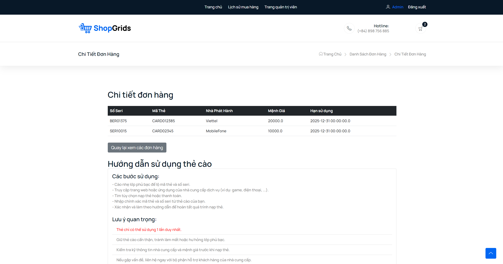

# Web_Card_Mobile

This project is an Maven Java web application that can allow admin can sell card mobile and the customer can buy by scan QR code. Customer also can browse, view details, add to cart, and purchase card.

## Highlight

- **Intergration payment gatway**: Call API payOS to create payment QR to make transaction. It allow to get information transaction.
- **Comprehensive CRUD Operations**: Efficiently manage users, orders, carts,cart type and publishers.
- **Tech Stack**: Java, Spring Boot, Bootstrap 5, HTML, CSS, JavaScript, and  MySQL.

*Note: This is a project group - subject SWP391 and not intended for public use.*

# Features

## Customer

### Login

The login page facilitates user access to the website. It includes a captcha to deter spam and features several important validations:

* Accounts are temporarily deactivated for 5 minutes after five unsuccessful login attempts with the correct username but incorrect password.
* All fields are required.

*Guests can also log in using their Google accounts.*

### Register

Register page allow guest sign up the account. Basic validation contain ....

### HomePage

The homepage prominently displays all active publishers. Clicking on a publisher reveals a list of card types available from that publisher. Administrators can manage these card types by editing, adding, or deactivating them. Customers can then select the card numbers they wish to purchase.

#### View Cart 

The cart page allows customers to review the items they have added, update quantities, and proceed to checkout.

### View History Order

The order history page displays all past orders made by the customer, including details such as order status, date, and total amount.

### View Order Detail 

The order detail page provides a comprehensive view of a specific order, including item details, quantities, and how to use this.

### View Profile

The profile page allows customers to view and update their personal information, such as name, email, and password.

## Admin

### View Statistic

The statistics page offers insights into sales performance, user activity, and other key metrics to help administrators monitor the application's success.

### View List Order 

The order list page enables administrators to review all customer orders, manage order statuses, and take necessary actions.

### View History Transaction

The transaction history page provides a detailed log of all financial transactions, helping administrators track payments and refunds.

### View List Account

The accounts page allows administrators to manage user accounts, including viewing account details, activating, or deactivating accounts.

### View List Publisher 

The publishers page lets administrators manage publisher information, add new publishers, or update existing ones.

### View List Card Type

The card types page enables administrators to manage different types of cards available for sale, including adding new types or modifying existing ones.

### View List Card 

The cards page allows administrators to manage individual cards, including their availability, pricing, and associated details.

